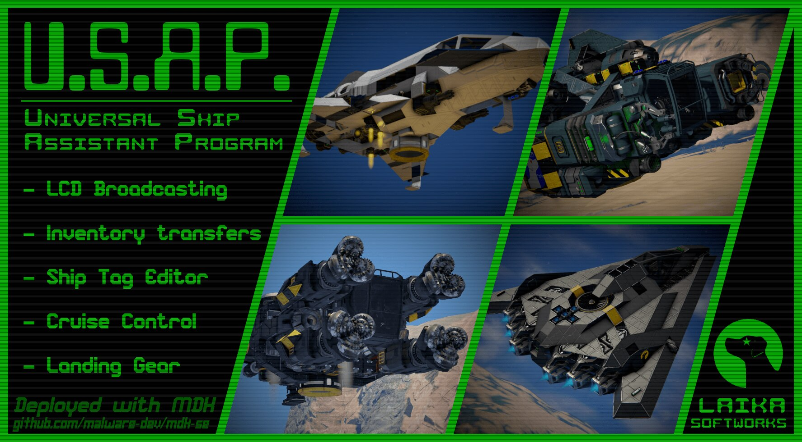

.. _usap-script:

****************************************
USAP (Universal Ship Assistance Program)
****************************************

TODO: add documentation from `here <https://steamcommunity.com/sharedfiles/filedetails/?id=2881009735>`_.

You can download the USAP script from the
`Steam Workshop <https://steamcommunity.com/sharedfiles/filedetails/?id=2922104789>`_.
