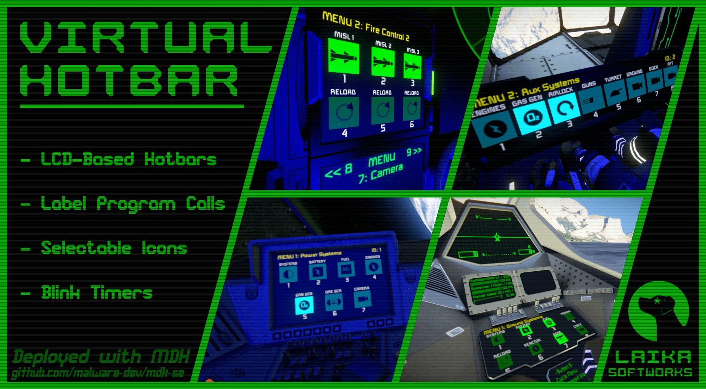

.. _virtual-hotbar-script:

**************
Virtual Hotbar
**************

Virtual Hotbar is a visual companion to the in-game hotbar.

It was created before the Contact DLC update as a way to better visually
represent programmable block commands, but has uses beyond this feature.

The virtual hotbar can be configured to reflect the status of different blocks
or even block assemblies (such as retractable landing gear) by illuminating
buttons for blocks that meet a specified condition, or blinking while the block
is working.

You can download the Virtual Hotbar script from the
`Steam Workshop <https://steamcommunity.com/sharedfiles/filedetails/?id=3351378956>`_.

.. toctree::
   :maxdepth: 1

   setup
   commands
   menu_parameters
   page_and_button_parameters
   toggle_block_arguments
   placeholders
   icons
   partial_hotbars
   screen_mirrors
   tips_and_tricks
