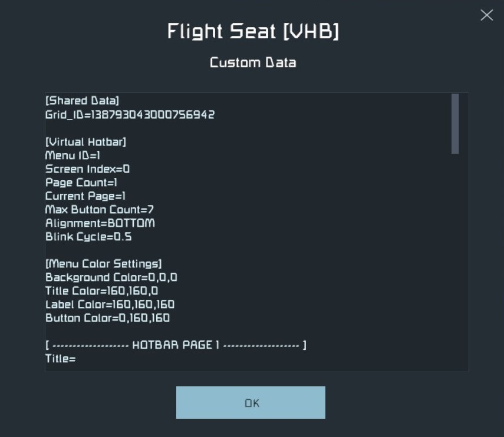

.. _menu-parameters:

Menu Parameters
===============

Parameters for the menu block can be found in the Custom Data of the menu
block, under the header *[Virtual Hotbar]*.

.. _menu-id-parameter:

**Menu ID** - Identifies the individual menu.
  Automatically set by the script. Avoid altering.

.. _screen-index-parameter:

**Screen Index** - Number of the screen the menu is displayed on.
  For use with multi-screen blocks.

  Main screen is always screen 0.

.. _page-count-parameter:

**Page Count** - The number of pages contained by the menu.
  Max Page Limit: 9

.. _current-page-parameter:

**Current Page** - Current page being viewed by menu.
  Automatically set by program.

  Can be set manually, or changed with commands
  :ref:`PREVIOUS_PAGE <previous-page-command>` and
  :ref:`NEXT_PAGE <next-page-command>`.

.. _max-button-count-parameter:

**Max Button Count** - Maximum number of buttons displayed per page.
  Maximum possible: 9

  Can impact button width.

.. _alignment-parameter:

**Alignment** - Vertical alignment of the menu:
  * TOP
  * BOTTOM
  * CENTER

.. _blink-cycle-parameter:

**Blink Cycle** - Approximate time (in seconds) of 1 cycle for blinking buttons.
  .. seealso::

     See the `Blink Length` option in the
     `Page and Button Parameters <page_and_button_parameters.html>`_ section.

.. _menu-parameters-updating-the-menu:

Updating the Menu
-----------------

After updating the menu configuration, be sure to run the :ref:`refresh-command`
command.
