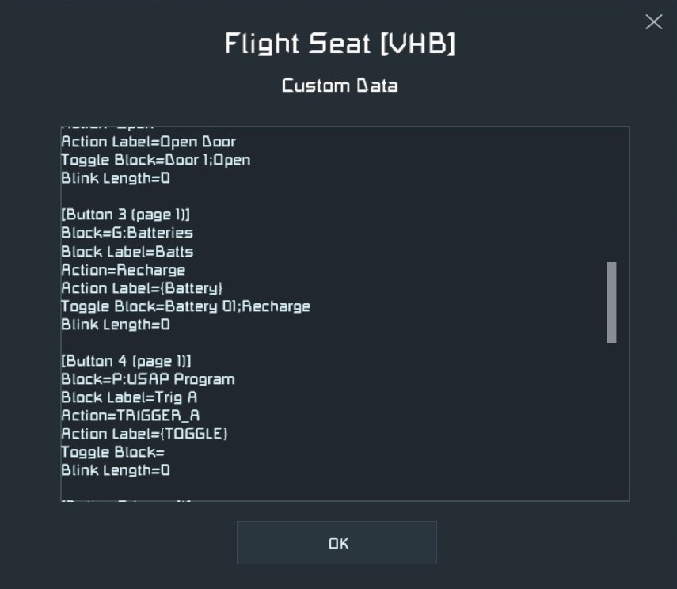

.. _toggle-block-arguments:

Toggle Block Arguments
======================

.. seealso::

   For information on how to configure a button to pair with a toggle block,
   see the section on
   `Button Parameters <page_and_button_parameters.html#button-parameters>`_.

By default, a button with an assigned Toggle Block will be lit when the Toggle
Block is powered on, and be dark when the Toggle Block is powered off.

This behavior can be inverted, however, by adding ``;OFF`` to the end of the
Toggle Block parameter under that specific button's heading in the menu block's
Custom Data.

.. TODO - give an example of using ;OFF with other parameters

Other attributes of the Toggle Block can be linked to the button by adding a
semicolon (``;`` ) and ``attribute-tag`` to the end of that button's Toggle
Block parameter in Custom Data.

Attributes by Block Type
------------------------

.. note::

   Attributes are case-insensitive.

* AIR VENTS

  * ``PRESSURIZED``
  * ``DEPRESSURIZED``

* BATTERY / JUMP DRIVE

  * ``RECHARGE``
  * ``CHARGED``

* HYDROGEN / OXYGEN TANK

  * ``STOCKPILE``
  * ``FULL``

* DOOR

  * ``OPEN``
  * ``CLOSED``

* SENSOR

  * ``DETECTED``
  * ``NOT DETECTED``

* LANDING GEAR / CONNECTOR

  * ``LOCKED``
  * ``AUTOLOCK``

* CONNECTOR

  * ``THROW OUT``
  * ``COLLECT ALL``

* THRUSTER / PISTON / ROTOR / HINGE

  * ``>`` + *value*
  * ``<`` + *value*

  .. note::

     * Value for Thruster is in Newtons
     * Rotor and Hinge values are in Degrees
     * Rotor and Hinge values should be in range ±180°
     * Piston values are in meters.

     *Example:* ``Toggle Block=Hinge 1;>85``

     Button will be lit if Hinge 1 is at an angle greater than 85°

.. TODO - give some examples for each type and what the configuration does
